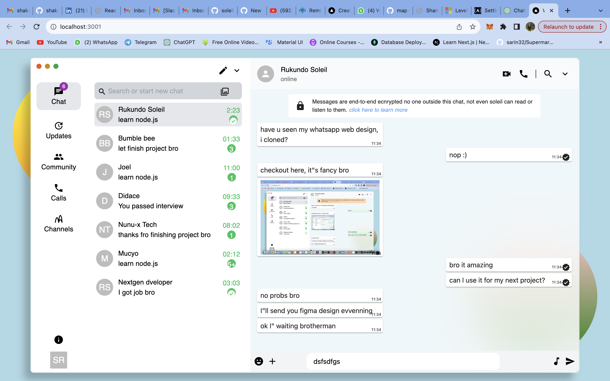

# WhatsApp Web UI Clone with Next.js and Material-UI



## Description

This project is a clone of the WhatsApp Web user interface, built using Next.js and Material-UI. It provides a visually similar experience to the official WhatsApp Web application.

## Features

- **Real-time Messaging:** Mimics the core functionality of sending and receiving messages in real-time.
- **Contact List:** Displays a list of contacts similar to WhatsApp Web.
- **User Authentication:** Implements a simple authentication system for demonstration purposes.

## Technologies Used

- [Next.js](https://nextjs.org/)
- [Material-UI](https://mui.com/)
- HTML
- CSS
- JavaScript


## How to Use

1. Clone the repository:

   ```bash
   git clone https://github.com/soleil00/whatsapp-clone-andela.git
